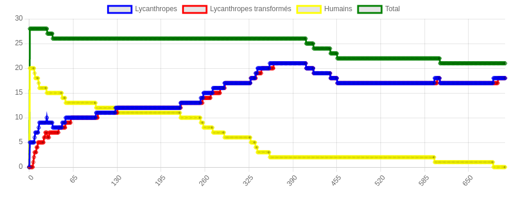
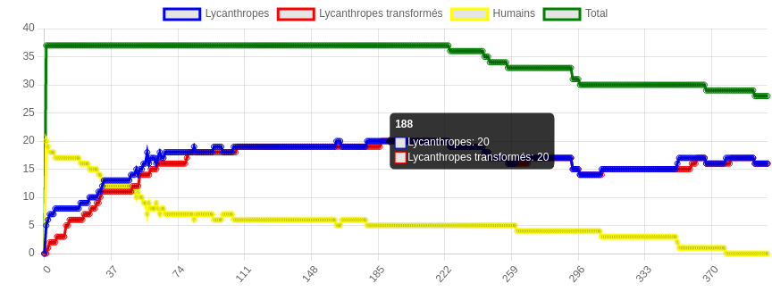
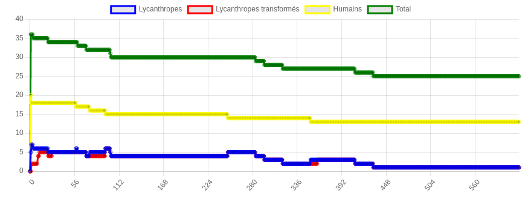

## Question 1
Pour faire sont attaque, le lycanthrope fouille son environnement
pour les villageois. Selon la définition d'agent vue en cours, 
un agent est capable de percevoir son environnement et d'agir dessus.
M'implémentation définit un agent, le lycanthrope, capable de percevoir son
environnement et des autres agents présents, les villageois, 
et d'agir (attaquer les villageois).

## Question 2
Les lycanthropes ont gaigné dans presque toutes les simulations faites, cela veut dire,
les lycanthropes on transformé tous les villageois en lycanthropes. 
La système prendre souvent plus de 500 cycles pour converger vers un résultat.

Le changement dans le nombre d'apothicaires ne fait pas assez de différence, 
vue qu'un apothicaire doit être très proche d'un lycanthrope et celui ne doit pas être
transformée, la majorité des villageois infectés se transforment avant qu'un apothicaire
soit proche. L'augmentation du nombre de chasseurs peut entraîner le système à un résultat
ou soit tous les lycanthropes sont tués, soit il n'y a pas de convergence parce que 
les lycanthropes n'arrivent pas à attaquer tous les villageois, et ni les chasseurs
sont assez proches des lycanthropes pour les tuer. Si on augmente le nombre de
lycanthropes au début de la simulation, le système peut converger plus rapidement.

## Question 3


Il est possible de regarder sur le graphique qu'après quelques cycles, 
presque tous les villageois ont été transformés en lycanthropes,
tous les villageois ont été transformés en lycanthropes après 700 cycles.

## Question 4
La simulation avec un nombre plus grande d'apothicaires(10) a généré le graphique suivant.


Dans ce graphique on peut voit qu'augmenter le nombre d'apothicaires n'a pas fait 
un effet sur la convergence du système, les lycanthropes ont transformé tous les 
villageois avant le fin de la simulation.

a simulation avec un nombre plus grande de chasseurs(10) a généré le graphique suivant.


Dans cette simulation, les lycanthropes ont été tous tués par les chasseurs pendant
qu'il a resté des humains non-lycanthropes.

Ces graphiques correspondent à l'idée que l'apothicaire ne fait pas assez de 
différence dans le système, et que si on augmente le nombre de chasseurs, tous
les lycanthropes seront tués.

## Question 5
Les paramètres qui ont plus d'influence sur la simulation sont le nombre 
de lycanthropes et de chasseurs, le nombre de lycanthropes peut définir si la 
simulation convergera à un résultat ou les lycanthropes ont gagné, ou ils ont perdu parce
qu'ils sont ou tués par les chasseurs ou n'ont pat attaqué tous les villageois. 
Le nombre de chasseurs influence la probabilité d'un lycanthrope de trouver
un chasseur et d'être tué, s'on l'augmente, les lycanthropes seront tous tués.

## Question 6
Le nombre d'apothicaires peut faire que la simulation soit terminé avec quelques 
villageois restants, mais dans la majorité des cas, les lycanthropes infecterons
tous les villageois. 

## Question 7
|    |   n_apothicaires |   Run |   Humains |   Lycanthropes |   Lycanthropes transformés |   Total |   n_villagers |   n_lycanthropes |   n_chasseurs |
|---:|-----------------:|------:|----------:|---------------:|---------------------------:|--------:|--------------:|-----------------:|--------------:|
|  0 |                0 |     0 |         0 |             35 |                         35 |      36 |            50 |                5 |             1 |
|  1 |                1 |     1 |         0 |             34 |                         34 |      36 |            50 |                5 |             1 |
|  2 |                2 |     2 |         0 |             38 |                         38 |      41 |            50 |                5 |             1 |
|  3 |                3 |     3 |         0 |             30 |                         30 |      34 |            50 |                5 |             1 |
|  4 |                4 |     4 |         0 |             35 |                         35 |      40 |            50 |                5 |             1 |
|  5 |                5 |     5 |         0 |             43 |                         43 |      49 |            50 |                5 |             1 |

Les résultats sont d'accord avec l'hypotheses, dans tous les cas les lycanthropes ont infectés tous les villageois.
On peut conclure à partir de ces simulations que le résultat de la simulation ne dépend pas de le nombre d'apothicaires.

## Question bonus
Le temps pour essayer tous les combinations de paramétrés croisse avec le nombre de paramétrés et leur domain,
chaque paramétré ajouté multiple le temps de simulation par le nombre de valeurs possibles, pour faire varier tous les
variables, la simulation peut prendre un temps prohibitif.

La solution est d'utiliser la fonction batch_run(), le paramétrè number_processes, quand définit comme *None* utilise
tous les processeurs disponibles du ordinateur, en tournant les simulations en paraléle.

```
def run_batchMP():
    result = batch_run(Village,
              parameters={
                  "n_apothicaires": range(0, 6, 1),
                  "n_villagers": range(25, 50, 5),
                  "n_lycanthropes": range(2, 10, 2),
                  "n_chasseurs": range(0, 6, 1)
              },
              number_processes=None)

    print(result)
```


